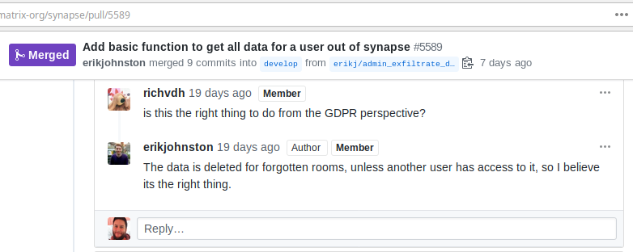
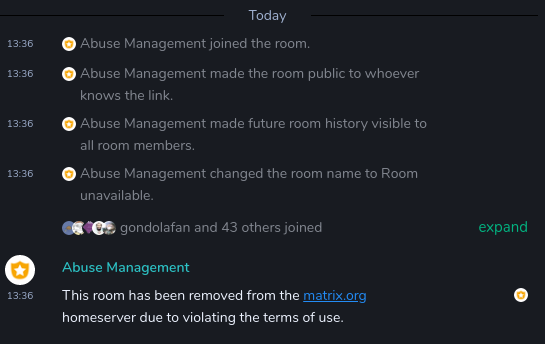

# Notes on privacy and data collection of Matrix.org, Part 2

---

**License:** [CC BY-NC-SA 4.0](https://creativecommons.org/licenses/by-nc-sa/4.0/). - See [Editorial Notes](#editorial-notes) for Attribution details.    
**Published on:** [Gitlab](https://gitlab.com/libremonde-org/papers/research/privacy-matrix.org/tree/master/part2), [GitHub](https://github.com/libremonde-org/paper-research-privacy-matrix.org/blob/master/part2)

---

## DISCLAIMER

This research and investigation document contains legal references, but **this document is NOT
legal advice and does NOT claim to be legal advice. The individuals and organisations that contributed to this
document are not lawyers, and do NOT represent lawyers.** We have written this document in good faith and in the spirit of individuals exchanging knowledge and information in plain English. This document only contains non-legal advices in the spirit of sharing. In doubt or if you need further explanation on a legal mater, please seek legal consult.

**EXCEPT AS A REFERENCE IN A GDPR REQUEST, DO NOT USE THIS DOCUMENT IN A LEGAL SETTING WITHOUT CONSULTING A LAWYER.**

This document contains facts, interpretations, opinions and personal experience mixed together.  
**Facts**: Backed up with a source or a link, and use affirmative wording.  
**Opinions**: Use subjective wordings without a link. They can be recognised by phrases being/similar to "*in our opinion*", "*we believe*", "*we think*", "*it seems that*", "*apparently*", "*obviously*", etc.  
**Interpretations:** Use subjective wording with links. Phrasing will be similar to "*our interpretation of*", "*translates to*", "*is seen as*", "*it means*", "*this means*", "*for regular users*", "*for non-technical users*", "*this basically means*", "*typically*", etc.

If you believe the wording of a sentence is problematic and misleading given the context and intended point, feel free to give us feedback in the outlined method of contact at the bottom of this document. We will take into account all reports of such misleading wordings in good faith.

## TL;DR
After further research and analysis based on our [first document](../part1/README.md), and despite the changes that took place since then, we believe that [New Vector LTD](https://beta.companieshouse.gov.uk/company/10873661) and [The Matrix.org Foundation CIC](https://beta.companieshouse.gov.uk/company/11648710) representing `matrix.org` and `vector.im`:

- Do not comply with [EU GDPR](https://eur-lex.europa.eu/legal-content/EN/TXT/?qid=1532348683434&uri=CELEX:02016R0679-20160504) ([Portal](https://ec.europa.eu/info/law/law-topic/data-protection/data-protection-eu_en)).
- Do not follow guidelines, best practices and explicit requirements outlined in [ICO](https://ico.org.uk/) [Guide to GDPR](https://ico.org.uk/for-organisations/guide-to-data-protection/guide-to-the-general-data-protection-regulation-gdpr/) for those who have day-to-day responsibilities.
- Fail to uphold the [fundamental principles of GDPR](https://ico.org.uk/for-organisations/guide-to-data-protection/guide-to-the-general-data-protection-regulation-gdpr/principles/lawfulness-fairness-and-transparency/): [Lawfulness](https://ico.org.uk/for-organisations/guide-to-data-protection/guide-to-the-general-data-protection-regulation-gdpr/principles/lawfulness-fairness-and-transparency/#lawfulness), [fairness](https://ico.org.uk/for-organisations/guide-to-data-protection/guide-to-the-general-data-protection-regulation-gdpr/principles/lawfulness-fairness-and-transparency/#fairness) and [transparency](https://ico.org.uk/for-organisations/guide-to-data-protection/guide-to-the-general-data-protection-regulation-gdpr/principles/lawfulness-fairness-and-transparency/#transparency).
- Are not able to correctly and in a timely manner process GDPR data requests.
- Are discriminating against non-technical users with GDPR matters.
- Are attempting to withhold data and answers from individuals that are entitled to them, by deleting said data from their system before completing their GDPR requests, [being a Data Protection Act 2018 Offense](https://ico.org.uk/for-organisations/guide-to-data-protection/guide-to-the-general-data-protection-regulation-gdpr/individual-rights/right-of-access/#5).
- Are using deceptive communications, misleading policies and difficult to understand terms of services to limit the scope of GDPR Data requests only to Homeserver services, while providing several **independent** others.

**This document includes the [disclosure of a Personal Data Breach](#personal-data-breach-disclosure) by Matrix.org.**

**If you currently have a Matrix account on any server, not just `matrix.org`, we strongly encourage you to consider if you need to [make a complaint](https://ico.org.uk/make-a-complaint/) with the English GDPR Authority, [ICO](https://ico.org.uk) regarding Matrix.org processing of your data until now.**

## Foreword

On June 13th 2019, we published [Notes on privacy and data collection of Matrix.org](https://gist.github.com/maxidorius/5736fd09c9194b7a6dc03b6b8d7220d0) detailing how, from a software perspective, Matrix.org managed to create an ecosystem where they received a tremendous amount of personal data for years in a way people would not expect or even suspect. Even after we had been keeping a close eye on that matter for the past two years, we only realised how far and wide it spanned while we wrote the document. It is only after having all the various elements come together in a single document that we understood the scale of what was happening.

On the next day, Matrix.org gave us a [full review of the notes](https://web.archive.org/web/20190614042212/https://matrix.org/~matthew/Response_to_-_Notes_on_privacy_and_data_collection_of_Matrix.pdf), along with comments on GitHub and other social platforms: While "*some points are accurate*":

- "*Much of the rest is incorrect or hyperbolic however*" ([context](https://web.archive.org/web/20190714170716/https://gist.github.com/maxidorius/5736fd09c9194b7a6dc03b6b8d7220d0#gistcomment-2943323))
- "*most of the rest of it is alarmist and disproportionate FUD*" ([context](https://news.ycombinator.com/item?id=20179982))
- "*there is a bunch of stuff which is simply incorrect, which is frustrating*" ([context](https://news.ycombinator.com/item?id=20186400))

We provided [one last set of replies](https://gist.github.com/maxidorius/5736fd09c9194b7a6dc03b6b8d7220d0#gistcomment-2945336) to Matrix.org, clarified a few items and amended one sentence that was potentially incorrect. See the [Gist revisions](https://gist.github.com/maxidorius/5736fd09c9194b7a6dc03b6b8d7220d0/revisions) for a full change history of the notes.

To this day, Matrix.org has not challenged the document technically, or factually. We believe it is accurate in its current form and not "*incorrect*", "*hyperbolic*", *alarmist*", or "*disproportionate FUD*". We have received a lot of positive feedback and encouragements to continue our work, and we have seen actual perception changes of Riot that make us believe our work has indeed been useful one way or another:

- [PRISM Break](https://prism-break.org/en/) has [removed Riot from their recommendations](https://gitlab.com/prism-break/prism-break/commit/e4702307d0b8bf67e34d3c774792aae604553272).
- [Privacytools.io](https://www.privacytools.io/) has [removed Riot from their recommendations](https://github.com/privacytoolsIO/privacytools.io/pull/1047).

When we wrote the first research document, we didn't think we would ever feel the need to write a second one. We held some hope that Matrix.org would finally take Privacy seriously, after [quickly dismissing raised concerns](https://github.com/prism-break/prism-break/issues/1936#issuecomment-384700587) on [various](https://github.com/matrix-org/synapse/issues/4540) occasions [in the past](https://docs.google.com/document/d/135g2muVxmuml0iUnLoTZxk8M2ZSt3kJzg81chGh51yg/edit#heading=h.ed3lumlafc26). The first document aimed to shed light on the software created by Matrix.org, its promotion and how it had a direct impact on the privacy of users. It was a technical document at its core, focused on a specific software stack. This research document will take on a different approach.

## Purpose and Scope

This document is a research paper by [Libre Monde ASBL](https://www.libremonde.org/), nonprofit dedicated to protecting people's privacy. We had the need to document privacy points for [The Grid Protocol](https://gitlab.com/thegridprotocol/home#the-grid) project, fork of the Matrix protocol. This paper will be used to create guidelines and recommendations on building the protocol. It will be used for our own governing body/landing website and to evaluate Grid implementations in their handling of users' privacy. It will be used to help create the right tools, processes and documentation to help Users, Developers, and System administrators alike in a post-GDPR world.

---

This document will focus on:

- The users themselves, as GDPR individuals.
- Introduce, explain with simple words and put in context GDPR concepts that people struggle with.
- Research if and how Matrix.org practices affect the GDPR rights of those users.

This document will:

- [Explain in plain English the relevant GDPR concepts and processes](#eli5-matrix-gdpr-in-easy-english), applied to Matrix and Matrix.org.
- Describe the rights of Matrix users as GDPR individuals, and the obligations of Matrix.org towards them as a Data Controller/Processor.
- Show [how a real GDPR Request with Matrix.org plays out](#gdpr-request):
  - Describe the step-by-step of the events, and explain how this real-world example maps to GDPR abstract concepts.
  - Show how we established what New Vector Ltd, Data processor of Matrix.org, should provide.
  - Compare what we were supposed to receive against what we were provided.
  - Evaluate if the GDPR Data access request was handled correctly by Matrix.org.

- [Disclose the preliminary analysis](#personal-data-breach-disclosure) of a [Data Breach](https://ico.org.uk/for-organisations/guide-to-data-protection/guide-to-the-general-data-protection-regulation-gdpr/personal-data-breaches/#ib1), where Matrix.org leaked a sizeable amount of personal data.

We will attempt to answer the following questions:

- Has Matrix.org improved its privacy practices since the first research document?
- Has Matrix.org made **significant** improvements to its software base regarding privacy?
- Is Matrix.org compliant with [the seven key principles](https://ico.org.uk/for-organisations/guide-to-data-protection/guide-to-the-general-data-protection-regulation-gdpr/principles/) of GDPR?
- Is Matrix.org going the extra mile to protect your privacy?

To do so, we will mainly use the guides of the English Supervisor Authority, [ICO](https://ico.org.uk/), who oversees New Vector and The Matrix.org Foundation. They have one of the most comprehensive set of guides we ever came across. We will mainly rely on their [Guide to the General Data Protection Regulation (GDPR)](https://ico.org.uk/for-organisations/guide-to-data-protection/guide-to-the-general-data-protection-regulation-gdpr/) available under the [Open Government License v3.0](http://www.nationalarchives.gov.uk/doc/open-government-licence/version/3/), which contains in-depth, practical information, very effective checklists and is directly targeted at those who have day-to-day responsibilities.

We believe it to be a very educational guide as it shows what entities have to do when it comes to GDPR, and by extension how individuals' rights fit in that. It is also directly tailored to English organisations and incorporate other English laws into a single, unified guide. For ease of use, links pointing to this guide will start with `ICO -`.

We wrote this document so that it does not rely on you following those links directly, while giving you a chance to open them in background tabs and come back to them later, ideally after you have read a section entirely. They usually add valuable context to help you understand the subtleties/exceptions that could apply. Such details might be lost in our effort to keep this document as accessible as possible.

**DISCLAIMER REMINDER:** We are not lawyers. This document is not legal advice. In doubt, always seek legal advice.

## ELI5 Matrix GDPR: in easy English

---

**IMPORTANT:** This is an [Interpretation](#disclaimer) section. First and foremost, always apply common sense to any content found in this section. **This content is a simplified version of GDPR, scoped to the purpose of this document.** **It cannot be used in a context other than Matrix.**

---

GDPR is a lengthy and complex law, but not all of it is directly relevant when using an ecosystem like Matrix or dealing with an entity like Matrix.org. To make it easy, we tried to name concepts/processes using memorable one-liners which we may refer to later to help you keep track of how GDPR is applied to practical situations.

Even if you are familiar with GDPR, we strongly advise that you read this section, at least to know and understand the context in which the rest of the document has been written and our approach in the various analyses.

### You speak England very best

Like every law, you might understand each word individually, but they make no sense whatsoever when you read the sentence. GDPR is no different: it is still a law. But GDPR was created so you don't need to *speak England very best*. When needing to get in touch with someone to use your rights, you can just talk normally. No need to make smart sentences (unless you want to) or be afraid you will sound stupid. You are also allowed to not be happy, or be frustrated. **When asserting your fundamental GDPR rights, be yourself. Speak normally. Be human. The other side is human too and must handle your requests that way.**

Let's explain a few concepts that will come back over and over again in this document: they are the GDPR technical term for concepts you already know. If you know them, it will makes it easier to understand what others will say when talking about GDPR:

**[Data subject](https://ico.org.uk/for-organisations/guide-to-data-protection/introduction-to-data-protection/some-basic-concepts/#8)**: a person, like you and me. We will follow [ICO choice to use *individual* instead](https://ico.org.uk/for-organisations/guide-to-data-protection/introduction-to-data-protection/some-basic-concepts/#8), which sounds nicer and makes it easier to understand this document. A data subject is only a person who is alive. New Vector or the Matrix Foundation are not data subjects, since they are not people but organisations.

**[Personal data](https://ico.org.uk/for-organisations/guide-to-data-protection/introduction-to-data-protection/some-basic-concepts/#4)**: Anything about you: your name, your picture, your messages, your files, your list of preferred superheroes; as long as it is about You. In Instant Messaging, nearly all of what is exchanged is personal data. It's safe to assume anything you ever exchanged on Matrix is personal data. We'll use *data* and *personal data* interchangeably in this document. We always assume *personal data* unless said otherwise.

**[Data Controller](https://ico.org.uk/for-organisations/guide-to-data-protection/introduction-to-data-protection/some-basic-concepts/#6)**: They are those who made the plan on how your data will be used, that made sure it will not be illegal and that it will be safe for people. Ultimately, they are the one legally responsible for your data. They are those who you can ask questions from, or request information/your data from. They cannot ignore you. They can refuse to do something, but they must always reply and explain. You, as an individual, is more important than them.

**[Data Processor](https://ico.org.uk/for-organisations/guide-to-data-protection/introduction-to-data-protection/some-basic-concepts/#7)**: They are those who use your data and do something with it like the Data Controller told them to. The Data Controller is the boss, the processor is the assistant that does all the day-to-day work. Sometimes there is no processor because the controller does things itself. They must always tell you who is who with full legal details.

Because of the specifics of Matrix.org, we don't have to go into details about the distinction between Data Controller and Data Processor, and we can just go with a single word: *Organisation*. They are those who deal with your data.

**[Processing](https://ico.org.uk/for-organisations/guide-to-data-protection/introduction-to-data-protection/some-basic-concepts/#5)**: it just means using your personal data. Sending a picture of your cat to your friends? That's "*processing*". Making the voice call happen between you and your mom? That's "*processing*". Allowing a friend to find you thanks to your email address? That's "*processing*".

More technically: When you send a message in a room, accepting the message is "processing". Computing if it's allowed where you sent is "*processing*". Storing it in a database is "*processing*". Writing a line in the log file about your API call is "*processing*". Backing up the database with your data in it is "*processing*". Simply storing the backup is "*processing*". Sending it to another server is "*processing*". Being a reverse proxy is "*processing*".

Processing = pretty much anything you can think of.

**[Supervisory Authority](https://ico.org.uk/for-organisations/guide-to-data-protection/introduction-to-data-protection/some-basic-concepts/#9)**: For England, that's [ICO](https://ico.org.uk/). Basically, they are the ones in charge to moderate on GDPR. They are the one who decide if an Organisation screwed up, and they are the ones individuals can talk to if there is a serious problem with an Organisation. It's always a good idea to talk with them if you feel there is something really wrong going on.

### Me, myself & I

It is easy to identify personal data like messages, pictures, videos, recording, or anything that the user sends directly: it is anything that the individual provided themselves to the Organisation. On the other hand, it becomes less obvious when talking about *metadata*. Metadata is everything else that is attached to the data provided by the individual. Metadata counts as personal data if it can be used to identify you.

In Riot, every time you send something into a room, metadata is attached to it by the server. You will typically find:

- Your Matrix ID, so others know who sent it.
- The time at which you sent it.
- The name of the server itself, so people can reply to you.
- Other technical attributes that are used by servers and clients to know what to do with those messages.

This also applies to HTTP, the protocol underneath Matrix, which adds its own metadata. There is a lot of low-level metadata going around every time you do something in your Matrix client, and all that metadata can identify you if combined with enough other metadata.

Personal data has nothing to do with it being available publicly or not. It is all about how likely it is to identify you, as a person, or to single you out enough so that you are, for all intents and purposes, uniquely identified.

A few important caveats to this:

- What is personal data for one Organisation is not always for another.
- What makes a piece of data personal is not absolute. While unlikely, it is always possible for an Organisation to argue it is not.
- Data does not have to be correct to be personal. If an Organisation misspelled your name in their system, it is still personal if someone can look at it and understand that it is about a single individual.

In the following sections, we will break down metadata into several categories to better understand which exists in Matrix, and how they matter.

#### Hi Mom, I'm on Matrix!

If some metadata directly identifies you, then it's personal data. Those typically are:

- your real name.
- your nickname.
- your username.
- if based on your real name, your Matrix domain (`server_name` in synapse configuration).
- your Matrix User ID.
- your [Matrix profile](https://matrix.org/docs/spec/client_server/r0.5.0#profiles), and what it is made of:
  - your display name.
  - your avatar (content and/or URL)
- your email address.
- your phone number.
- any [3PID](https://matrix.org/docs/spec/appendices#pid-types) you [added to your account](https://matrix.org/docs/spec/client_server/r0.5.0#adding-account-administrative-contact-information), or [mapped to your Matrix ID](https://matrix.org/docs/spec/identity_service/r0.2.1#establishing-associations).

#### VERY VERY Super VIP

If metadata is generated for you, is unique and/or secret, and is linked to you and only you, then it is personal data. It is especially true if that is done for authentication and/or authorisation: one could have access to systems or services that hold other data.

Those typically are:

- your [client access token](https://matrix.org/docs/spec/client_server/r0.5.0#client-authentication).
- your Matrix devices, directly [tied to your access token](https://matrix.org/docs/spec/client_server/r0.5.0#relationship-between-access-tokens-and-devices).
- your Matrix [E2EE devices/public keys](https://matrix.org/docs/spec/client_server/r0.5.0#id122).
- your smartphone [push key](https://matrix.org/docs/spec/client_server/r0.5.0#get-matrix-client-r0-pushers).
- an [OpenID token](https://matrix.org/docs/spec/client_server/r0.5.0#id199), typically used in your Integration Manager (widgets, sticker packs, etc.).
- in case of a [Bridge](https://matrix.org/bridges), your User ID on the remote network if applicable.

#### Extra points with our store's loyalty card

If some metadata links to you via a device, either because you are the only owner/user of the device, or because the data is only usable after you unlocked your device/logged in your computer, then it is personal data.

Those typically are:

- [HTTP Cookies](https://en.wikipedia.org/wiki/HTTP_cookie) with a unique ID value, [like `_cfduid` from Cloudflare](https://gist.github.com/maxidorius/5736fd09c9194b7a6dc03b6b8d7220d0#sharing-permalinks) which Matrix.org uses.

#### Hey there! I almost didn't recognise you!

Finally, there is everything else which is not about you, but about something you use.

Some of that metadata is linked to things rather than individual uses, like an [IP address](https://en.wikipedia.org/wiki/Internet_Protocol) links to your router. Some other is generated by a software you use, like [Some HTTP headers](https://gist.github.com/maxidorius/5736fd09c9194b7a6dc03b6b8d7220d0#headers) sent by Matrix clients. But they still all originated from an individual. Either because they did something actively, or because a software they use is doing something in the background.

If it is possible to identify or single out an individual using several of those data pieces, then it is personal data. This is true if that process is reasonable: If those pieces of data are saved in logs and database on several servers but all managed in the same local network, then it is reasonable to think they might be used as personal data. If the pieces are each stored on USB dongles stored in vaults held by different, totally independent companies, then it is not reasonable.

This is also true for patterns related to behaviour, like whenever you are connecting to your Homeserver, or whenever Riot connects to the Integration server, or for pretty much anything that can be passively collected from the server side just because an individual is using services. This is called [Device fingerprinting](https://en.wikipedia.org/wiki/Device_fingerprint).

It is important to clarify that Device fingerprinting does not have to be done, to be a privacy problem: while Matrix.org could very well not do any kind of profiling on users (they claim not to in their privacy notice), the kind of data collected to do it is the same as the kind an Organisation would typically store in their server logs as part of normal activity. The data would be there, just not used for that purpose.

### It's Good to Be King

One fundamental change with GDPR is that it shifts the centre of power from Organisations to Individuals.

Before GDPR, big companies like Facebook relied on their overwhelming capacity to overpowering individuals in time, money, knowledge and number of lawyers so that they simply couldn't afford fighting to get info about themselves. This was possible because companies could simply ignore individuals' requests, since those were not based on explicit and defined rights with laws adapted to the current times.

Since GDPR, two important changes took place:

- It is now the obligation of a company to document, explain and make public all a person needs to know about processing of their personal data, including justifying why they choose to do something specifically, **IN CLEAR AND PLAIN LANGUAGE**. This is the [Right to be informed](https://ico.org.uk/for-organisations/guide-to-data-protection/guide-to-the-general-data-protection-regulation-gdpr/individual-rights/right-to-be-informed/).
- It is now the obligation of a company to provide an individual with all the personal data relating to them that they have, within a reasonable delay (one month) and in a common format (CSV, JSON, etc.). This is the [Right of access](https://ico.org.uk/for-organisations/guide-to-data-protection/guide-to-the-general-data-protection-regulation-gdpr/individual-rights/right-of-access/).

Those two individual rights are "absolute": regardless of how your personal data is processed, they always apply. GDPR has a total of [8 individual rights](https://ico.org.uk/for-organisations/guide-to-data-protection/guide-to-the-general-data-protection-regulation-gdpr/individual-rights/). The 6 others have conditions only under which they apply, and so people can only use them in specific cases, some of which we will discuss later.

Because GDPR makes it mandatory that an Organisation has prepared itself before dealing with personal data, it is OK to not know all the details when talking with a company. Because they must have thought about the details of the processing, identified how it could go wrong, or how data breaches can happen, they must always have a precise and detailed answer if you ask them to clarify a point.

It is also the obligation of the organisation to adapt their communication to the comprehension level of the individuals they process the data of. In case of Matrix.org, anyone can sign up to their services without understanding the technical details of the protocol. Because of that, it would be extremely hard to use specification knowledge to justify some processing.

**If you ever have to do any kind of extensive research to know if and how your personal data is processed and how it affects your rights, even after talking to the entity processing your data, then it is a red flag. You should strongly consider filing a complaint with their authority.**

### Better luck next time

GDPR has seven fundamental principles that defines the "spirit" of it. Out of those seven, we will first cover [Lawfulness, fairness and transparency](https://ico.org.uk/for-organisations/guide-to-data-protection/guide-to-the-general-data-protection-regulation-gdpr/principles/lawfulness-fairness-and-transparency/); This section will specifically cover [Fairness](https://ico.org.uk/for-organisations/guide-to-data-protection/guide-to-the-general-data-protection-regulation-gdpr/principles/lawfulness-fairness-and-transparency/#fairness).

While fairness existed to some extent in previous laws, it is now considered a fundamental principle in privacy protection: Organisations **MUST** consider how the processing they plan to do will impact people. They **MUST** also consider if the processing can harm someone. For example, allowing anonymous and unlimited access to 3PID mappings found on Matrix.org Identity server can expose individuals already at risk (activists, journalists, minorities, etc.) by handing out their Matrix IDs. 

It is also about understanding: if a document is written with difficult words, is very long, or includes any kind of shady tactics used in the industry for Terms of Services until now, then it is not GDPR compliant, in a way which breaks a fundamental principle of the law.

The wording that is used the most is that being fair is to handle people's data in ways they understand and would reasonably expect, or that would not object to the handling if it was explained to them. This wording is used many times in the [ICO - Guide to GDPR](https://ico.org.uk/for-organisations/guide-to-data-protection/guide-to-the-general-data-protection-regulation-gdpr/).

The ICO Guide also contains [one specific section](https://ico.org.uk/for-organisations/guide-to-data-protection/guide-to-the-general-data-protection-regulation-gdpr/principles/lawfulness-fairness-and-transparency/#fairness) which we believe is nicely worded (emphasis ours):

> **Processing of personal data must always be fair as well as lawful. If any aspect of your processing is unfair you will be in breach of this  principle – even if you can show that you have a lawful basis for the  processing.**
>
> In general, fairness means that you should only handle personal data  in ways that people would reasonably expect and not use it in ways that  have unjustified adverse effects on them. **You need to stop and think not just about how you can use personal data, but also about whether you should**.
>
> Assessing whether you are processing information fairly depends partly on how you obtain it. In particular, if anyone is deceived or misled when the personal data is obtained, then this is unlikely to be fair.
>
> In order to assess whether or not you are processing personal data fairly, you must consider more generally how it affects the interests of  the people concerned – as a group and individually. **If you have obtained and used the information fairly in relation to most of the  people it relates to but unfairly in relation to one individual, there will still be a breach of this principle.**

Fairness is **reactive**: Ensuring that no shady or unexpected actions are taken during processing, or when taking decisions that directly influence processing. For example, deleting personal data stored to avoid giving it in a GDPR request is not fair.

**If at any point you think you have been treated unfairly by an Organisation, it is a red flag that you were not informed correctly and you should consider reporting the entity to their authority and use your Right to be informed and Right of access and send a GDPR Data request to get all the information and data you need.**

### Sorry, we thought you knew

Transparency is very similar to fairness, they are basically two sides of the same coin. Both are about making sure the individuals know and understand what is happening with their data.

Transparency is **proactive**: Ensuring that one is proactive and forthcoming with **ALL** the needed information to make an informed decision. This is typically when you want to register on a server, but you don't really know who's running it, how, what do they do with your data, etc. This always involves telling you about the legal entities behind the services, or any kind of information that would reasonably influence your decision, like conflict of interests. This is not about technicalities, but about the relationship at the human level, and the trust around it.

### Alignment: Lawful Good

Last but not least: [Lawfulness](https://ico.org.uk/for-organisations/guide-to-data-protection/guide-to-the-general-data-protection-regulation-gdpr/principles/lawfulness-fairness-and-transparency/#lawfulness).

Under GDPR, everything relies on "having a lawful basis". Having a lawful basis simply means that the entity has researched, documented and prepared itself to handle a certain type of data in a certain way, knows what rights and obligations they have, as well as those of the individuals, and that they are [ready to be accountable for it](https://ico.org.uk/for-organisations/guide-to-data-protection/guide-to-the-general-data-protection-regulation-gdpr/accountability-and-governance/). Each type of service can have its own lawful basis, which will basically depend on how it is used.

Example: You decide to launch a full-stack Matrix server. The Homeserver service could theoretically be made under Contract, the Push server under Legitimate interest and the Bridges/Bots under Consent. On the other hand, **a service can only have one basis.** You cannot request consent on sign-up for the Push server if the privacy notice says it is under Legitimate Interest.

It is very important to know that lawful basis are not items you can stack, or pick and choose at will, or at random. There is no "downgrade" or "upgrade" mechanism available on a whim, or anything of the sort. [ICO - Lawful basis for processing](https://ico.org.uk/for-organisations/guide-to-data-protection/guide-to-the-general-data-protection-regulation-gdpr/lawful-basis-for-processing/#how) talks about this:

> You might consider that more than one basis applies, in which case you should identify and document all of them from the start.
>
> You must not adopt a one-size-fits-all approach. No one basis should be seen as always better, safer or more important than the others, and there is no hierarchy in the order of the list in the GDPR.

While it is possible to change lawful basis while processing data, there must always be internal documentation that explains why it was done, how it impacts the individuals and why the Organisation thinks it was needed to do it. That internal documentation is what the Regulator would review first in case of complaints or data breaches. Not having them can lead to the biggest fines.

**Basically, the choice of a lawful basis must be a very researched choice. The entity must always be able to explain in details their choices, and possibly show proof like the consent data or the contract data. The choice of lawful basis directly impact which rights are available to the individuals.**

In the scope of this research, we will cover two out of six lawful basis for processing:

- Consent
- Legitimate Interests

Consent and Legitimate Interests are two sides of a coin and what people will encounter the most often in Matrix and in most of the IM services available.

#### Consent

[Consent](https://ico.org.uk/for-organisations/guide-to-data-protection/guide-to-the-general-data-protection-regulation-gdpr/lawful-basis-for-processing/consent/) is about seeking direct user involvement, with the benefit of reduced responsibilities.

It would typically be used when:

- You want to do something inherently not privacy-friendly which would not be acceptable any other way, or you want to do something that is not related to the service you provide.
- You want to show your commitment towards privacy and give full control to the user to stop the processing whenever they want.

For example, the phone-home stats sent by Riot and synapse fall in this category: as an individual, it does not give you anything in return, but generating these stats require processing your personal data.

You may have seen us saying how we did not give consent for any processing in public exchanges when we believe some shady practices were afoot. We do so for the following reasons:

- Consent is usually given in private. A malicious individual could ask questions to the entity under Legitimate Interests pretences while having given Consent, which would not be fair nor transparent. By explicitly stating no consent was given, it engages the accountability of the individual as well. This is especially important in the scope of research documents like this one.
- Because Consent and Legitimate Interests are the most common lawful basis, by stating publicly one is not possible, it hints that the discussion should be viewed as one under Legitimate Interests.

#### Legitimate Interests

[Legitimate Interests](https://ico.org.uk/for-organisations/guide-to-data-protection/guide-to-the-general-data-protection-regulation-gdpr/lawful-basis-for-processing/legitimate-interests/) is about avoiding direct user involvement, at the cost of extra responsibilities.

It would typically be used when:

- You cannot directly contact the user, per example in the case of relaying a message from a remote server to a local user as part of the basic federation protocol.
- The processing is so inherently tied with what the user expects that you don't need to ask.

Legitimate Interests is one lawful basis which is easy to abuse: under claims of knowing what is best for the users, or what they would want, an Organisation would add more and more intrusive processing and rely on the fact that people don't usually bother to investigate or do not report "minor" things.

Lawful basis have one inherent safeguard that applies to all of them, which is of course for the entity to prove that is the case:

> The processing must be necessary. **If you can reasonably achieve the same
> result in another less intrusive way, legitimate interests will not 
> apply.**
>
> It is not enough to argue that processing is necessary because you have 
> chosen to operate your business in a particular way. **The question is 
> whether the processing is objectively necessary for the stated purpose, 
> not whether it is a necessary part of your chosen methods.**

Finally, Legitimate Interests means the entity using it has more upfront research to do. [ICO - Apply Legitimate Interests in practice](https://ico.org.uk/for-organisations/guide-to-data-protection/guide-to-the-general-data-protection-regulation-gdpr/lawful-basis-for-processing/legitimate-interests/#ib4) mentions at least one extra assessment (LIA) which should be undertaken, documented and kept in the internal GDPR archives of the Organisation.

**Basically, this means that an entity using Legitimate Interests should give you even more precise, clear and researched answers when justifying their processing since they must have gone through extra preparation. If they do not, this is a red flag.**

### I only have one rule: New Is Always Better

The final important point of GDPR is that any documentation, internal processes, lawful basis, data processing or any other item relating to personal data must be kept up to date, reviewed regularly and adapted if new circumstances arise. This is directly tied to Fairness and Transparency.

Per example, following the publication of our first research document, we would expect the legal entities behind Matrix.org to at least review without any delay their GDPR choices, documentation, risk assessment, and if their lawful basis is still valid. In case of Personal Data breach, which covers the very broad definition of "processing", we would expect individuals to be informed accordingly: not just that the privacy notice has changed, but why, and in a clear accountable way.

**Overall, GDPR is very human and centred on the individual: the spirit of the law matters, and entities who process personal data can no longer primarily consider their own benefits, goals or gains alone. They have to think from the individual point of view, desires, expectations and the effects/consequences that the processing will have.**

## Privacy at New Vector Ltd

### Privacy Notices

#### Martrix.org

Location: https://matrix.org/legal/privacy-notice  
Wayback Machine: https://web.archive.org/web/20190719133046/https://matrix.org/legal/privacy-notice

New Vector Ltd, as Data Controller of Matrix.org, did not see fit to change their privacy notice in light of our first research document. Given their obligation to review and adapt documents if circumstance arises, we believe they deem it appropriate and accurate. [Last commit](https://web.archive.org/web/20190723073001/https://github.com/matrix-org/matrix.org/blob/master/gatsby/content/legal/2018-05-24-privacy_notice.mdx) is dated 12th of June 2019, prior to publication.

#### Vector.im

Location: https://vector.im/privacy  
Wayback Machine: https://web.archive.org/web/20190723071344/https://vector.im/privacy

In our first research document, we documented the following:

> Vector.im has [a privacy notice](https://vector.im/privacy) which only applies to jobs and related applications, and does not seem to cover the Identity Server usage specifically, while only giving one lawful basis for processing, directly related to recruitment. It is therefore not known how the data submitted to `vector.im` is processed or shared.

This still has not changed. If a user attempts to use the URL configured by default in Riot, and find the Privacy Notice link at the bottom of the page, they land on a privacy notice that does not provide a lawful basis for Identity Server processing.

Within the feedback provided by Matrix.org to our first research document, a link was given to where a privacy notice targeted at `vector.im` Identity services could be found on GitHub, in a `vector.im` repository in a `matrix.org` folder.

We replied that this was not obvious or clear, failing to be Fair or Transparent, and we advised to directly have the privacy notice link found on the `vector.im` website point to that document.

We have reviewed this privacy notice, but it also does not give a lawful basis for Identity Services and only talks about Homeserver services, again failing to uphold the individual's Right to be informed while still **collecting personal data without a documented lawful basis**.

### Statistics computation and Profiling

We are worried that there might be misleading language from Matrix.org about profiling of entities, and would like to lay out what we have noticed that *may* tie to profiling and manual processing of collected data. Matrix.org claims to not do any kind of profiling in their privacy notice, but it is possible they could be using the data of individuals in a way they would think of it as profiling. We let the reader come to their own opinion on the matter.

---

Because Matrix is a federated protocol, people are free to spin up their own servers and not create accounts on Matrix.org. We have seen in our previous research document that it is very likely that those self-hosted servers or clients that use them will end up talking to `matrix.org` and with it, share some metadata about their users.

On the front page of Matrix.org, we can find the following under the "Messaging" introduction:

> You can reach any other user in the global Matrix ecosystem of over 9M users

Obtaining this number of `9M` involve some kind of processing on the data they received from other servers which is not essential to providing their service: you do not need to know how many users are in the global Matrix ecosystem to allow people to use a Homeserver, nor do you need to know it to run a server. Matrix.org has provided graphs about the uptake of users [in the past](https://matrix.org/blog/2017/07/07/a-call-to-arms-supporting-matrix) so this is not really a one-off thing either.

Producing and communicating uptake statistics about the very protocol an Organisation is creating is a normal and expected behaviour: this is how you would build community engagement and show progress to the World. What we are wondering about is:

- Which type of data are these statistics based on? Just Homeserver data? Homeserver and Identity? What about Integration servers?
- How are opt-in reports like phone-home stats included in this?
- Which of the legal entities behind Matrix.org is generating those numbers? New Vector Ltd or The Matrix.org Foundation?
- Because two of the Directors from New Vector are also Directors in The Matrix.org Foundation, which creates a conflict of interest, for which entity and related purpose are those numbers generated? New Vector or The Matrix Foundation?
- Are there more of these numbers generated?

## GDPR Request

How to make a GDPR Request for Matrix data is one of the undocumented yet crucial point of the ecosystem. Matrix.org does not provide any guidance whatsoever about GDPR, and does not provide any kind of guide or document.

To ensure that the ecosystem we will build as part of The Grid project, and so that anyone currently using Matrix has practical information in that respect, we decided to fully document the process of a GDPR request with Matrix.org when self-hosting, or at least when the individual does not have their Homeserver account on any Homeserver managed by New Vector Ltd, the current Data Controller of Matrix.org.

A full timeline and transcript is available in [Annex A](#Annexes) for the exchanges that took place between one of the authors and New Vector Ltd, over the course of 37 days: from June 13th 2019 to July 20th 2019.

**Over the course of this research into GDPR Requests, we came across a Personal Data Breach, detailed in [the next section](#Personal-Data-Breach-Disclosure) of this document.**

### The request

After discovering how intrusive was a recommended self-hosted stack and configuration from Matrix.org, we decided to include a GDPR Information request in the research itself in the [Closing words](https://gist.github.com/maxidorius/5736fd09c9194b7a6dc03b6b8d7220d0#closing-words) with an explicit mention to receive answers:

> While users on the matrix.org Homeserver have to explicitly agree to the Terms of Use and the privacy notice, no agreement is ever sought from users on self-hosted servers that also use `matrix.org` and `vector.im`.
> How is their data handled? Are they processed in some way? Which method of lawful processing under GDPR allows for this constant sharing of (meta)data? We hope such questions will be answered to ensure users' 
> privacy is handled appropriately.

Remember that [It's Good to Be King](#its-good-to-be-king): you actually do not have to use what's in the Privacy Notice. A request is valid if it is submitted by any means. It also cannot be used as a way of extending the one month time limit for responding ([ICO - Right of Access](https://ico.org.uk/for-organisations/guide-to-data-protection/guide-to-the-general-data-protection-regulation-gdpr/individual-rights/right-of-access/#4)). This also was a reasonable place to make such request: it was a review document that directly impacted Matrix.org and so they were bound to read it. The PDF feedback shows that the document was indeed fully read and reviewed, including those questions which were directly commented on.

The monthly period starts on the next calendar day of the request: 14th of June 2019.

After one week, we did not receive any acknowledgement or activity whatsoever that our request was taken seriously, despite being an official, clear request for information made by the two authors of the document. We decided to expand on our request and include data, fearing that Matrix.org might cover their tracks on the problematic Identity data. This was submitted to the dedicated GDPR Matrix user on `matrix.org`, following the Privacy Notice instructions.

We made sure to include and be explicit about the following in the spirit of fairness towards Matrix.org:

- An explicit request to include **ALL** data, and at the very least from all the services listed in the first research document, with a link to it.
- Allow New Vector Ltd to once again see that a request was already made one week before.
- That we wanted to be better informed about the consequences of the Security breach that happened not long before, as such Security breach had to be evaluated against our research document since [New is Always Better](https://git.kamax.io/libremonde/publications/research-privacy-matrix.org-part2#i-only-have-one-rule-new-is-always-better).

The request was sent and acknowledged to be received on the 20th of June 2019 by the GDPR Operator of Matrix.org.

On the 17th of July 2019, more than a month since we made our original request, Matrix.org produced a Homeserver extract of the individuals' personal data, already outside of the one month period. We do not know why Matrix.org took two extra days to send our personal data to us, which we believe is undue delay and has a direct impact on the rest of the request. See [Annex B](#Annexes) for file timestamps.

On the 19th of July 2019, more than a month since our initial request, the GDPR operator gets back in touch with us and wants to send our data: a 2 GB compressed file in a E2EE room. The Operator informs us that he will split the file to fit the upload max file size between the servers, and would expect us to re-assemble it on our end. The Operator also informs us previous GDPR requests were handled that way.

For us, this is a red flag. There is direct discrimination towards non-technical users that would need to open a command prompt, run an advanced command with a high risk of mistake: given Matrix.org has a 100 MB limit, it would have taken about 20 files to list in the right order while using a command prompt, if using the GDPR Operator method.
It is also a red flag as Matrix.org failed to take into account users that are not technical. While other platforms or services provide a simple URL with a simple username and password (Basic Auth), Matrix.org chosen process which must be put together before even delivering the service fails to even consider non-technical people. There was no attempt to make this easy as possible.

We voiced our concern and did not accept to receive the data in any other format than a common one as per our GDPR rights, like a file in ZIP format. `.tar.gz` files cannot be opened on all systems, per example on a Windows system, without a 3rd party software. Installing a 3rd party software which may not be possible because:

- The user might not have the rights to do so on that machine.
- They simply do not know how.
- It would be unsafe for them to do so (they might follow a sponsored link and end up being infected by a virus).

Matrix.org then attempted to send us a PGP-encrypted file. Once again, this is a red flag: On top of the reasons listed above, PGP is not an easy tool set. It is an advanced tool, and is very rarely installed for non-technical users. It is also a very questionable move given [the recent attack on Key servers and the risk of breaking the PGP install itself](https://gist.github.com/rjhansen/67ab921ffb4084c865b3618d6955275f).

90 minutes after our request to get a simple URL, the GDPR Operator offered to give us a URL protected by [HTTP Basic Authorisation](https://en.wikipedia.org/wiki/Basic_access_authentication). Given that such authentication mechanism is present on all major platforms and all major browsers, it was acceptable. It also had the benefit that if only the URL was strictly usable, one could be made with the credentials.

About an hour after and while our GDPR Data access request was being handled, Matrix.org published a [blog post](https://matrix.org/blog/2019/07/19/privacy-changes-to-new-vector-identity-servers) announcing that some identity data was erased "*where there is any chance that the data subject didn't understand how, why or with whom their data was being shared*". While we'll go in more details about that erasure specifically, it meant that data that was part of the ongoing request had been deleted (which we confirmed). This action had a direct, significant impact on the individual's ability to exercise their rights:

- The request processing was already past the legal one month period.
- The GDPR Operator was the one publishing the blog post, as they identified themselves by name.
- The GDPR Operator recognised the identity of the individual, fully knowing his technical background and that Identity data would be the highest focus, but remained silent on the matter.
- The GDPR Operator was not Transparent about what would happen on that day, nor did they attempted to reach out to the individual on the 17th when Identity data was most probably still available.
- In the past, Matrix.org was confident they had a lawful basis for processing Identity data. They showed no sign to ever reconsider the validity of their processing until the first research document was produced and the specific question of lawful basis was brought up.

[ICO - Right of Access](https://ico.org.uk/for-organisations/guide-to-data-protection/guide-to-the-general-data-protection-regulation-gdpr/individual-rights/right-of-access/) has a [dedicated section](https://ico.org.uk/for-organisations/guide-to-data-protection/guide-to-the-general-data-protection-regulation-gdpr/individual-rights/right-of-access/#5) about this:

> **We have received a request but need to amend the data before sending out the response. Should we send out the “old” version?**
>
> **It is our view that a subject access request relates to the data held  at the time the request was received.** However, in many cases, routine  use of the data may result in it being amended or even deleted while you  are dealing with the request. So it would be reasonable for you to supply information you hold when you send out a response, even if this is different to that held when you received the request.
>
> **However, it is not acceptable to amend or delete the data if you would not otherwise have done so. Under the Data Protection Act 2018  (DPA 2018), it is an offence to make any amendment with the intention of preventing its disclosure.**

At this time, it is our belief that the legal entities behind Matrix.org:

- have committed an offence under DPA 2018
- have failed to provide a lawful basis for their Identity data processing
- have failed to be Fair and Transparent
- have failed to respond to the GDPR request without undue delay.

When we became aware of the blog post, we immediately informed the GDPR Operator that we expected to still receive the data now deleted from the live server, and the access log to our personal identifiers on the Identity API. The GDPR Operator ignored our statement, and provided us with a URL, a login and a password to a ZIP file.

The GDPR Operator then informed us that the ZIP file contained all our rooms events, but did NOT contain our group memberships, which they provided in plain text in the chat, failing to provide the data in a machine readable format, and simply failing to add it to the ZIP that was just transmitted.

Once we downloaded the ZIP, we informed the GDPR Operator that the extract was not complete. We repeated several times that it was their obligation to ensure all the data we requested, and knew Matrix.org had, was provided and that such data should have been given to us in a more pro-active manner already.

Two hours later, we received two more files:

- A ZIP with a Markdown containing Scalar data and logs of `matrix.org` Identity server.
- A ZIP containing one PDF, with answers to our GDPR questions, and the privacy notice of Matrix.org in HTML format.

These files still did not contain:

- The mandatory data that Matrix.org should have provided (shown in the next section).
- A document with [all the privacy information required to be disclosed](https://ico.org.uk/for-organisations/guide-to-data-protection/guide-to-the-general-data-protection-regulation-gdpr/individual-rights/right-to-be-informed/#provide) for all the different processing of data currently taking place.

We expressed our dissatisfaction and asked again to be given all the information and answers.

The GDPR Operator replied with the following:

> You have all of the available data - we have nothing in identity, nothing in push, the integration
> server data is provided in the additional_data dump.

Ironically, that reply triggered an Android notification using a personal identifier known as a Push Key, which we mentioned previously. Challenging that point, and knowing that [the push server does read and write extra data linked to that push key (database, logs)](https://github.com/matrix-org/sygnal/blob/master/sygnal/gcmpushkin.py#L82), we insisted.

Finally, the GDPR Operator forcefully ended the discussion by deleting their E2EE device (either manually or logging off) with the final statement:

> The push service operates without processing your personal data, thanks.

### Expected content

#### Domains in scope

New Vector Ltd is a Data Controller or Data Processor of following domains, as per their privacy notice:

- `vector.im`
- `matrix.org`
- `modular.im`

As per their contractual obligations, they also are for any  `modular.im` client, who either:

- Use their own client domain.
- Use a sub-domain of `modular.im`.

Our request specifically mentioned all of them:

> My request explicitly includes any other services and companies for which you are the controller as defined by Article 4(7) GDPR

#### Answers

**NOTE:** This section is incomplete and originally supposed to be completed with a detailed analysis.  
The COVID pandemic put a halt to those plans sadly. We won't finish these sections or add more content.

---

For each domain, we expected a specific answer to the following questions and/or a link to a Privacy notice with them:

1. The lawful basis for processing our data.
2. If processing by Consent or Contract, detailed proof of the consent or the contract.
3. What do they use it for.
4. Because there are [special categories of data](https://ico.org.uk/for-organisations/guide-to-data-protection/guide-to-the-general-data-protection-regulation-gdpr/lawful-basis-for-processing/special-category-data/) in GDPR, the categories of personal data concerned.
5. With who the data will or has been shared (we don't know if this includes breaches).
6. For how long the data is stored, or how we can calculate the duration.
7. If we did not give the data directly, the identity of the source. **This is especially relevant for a federated network like Matrix.**
8. If there is an automatic decision-making process under specific articles of GDPR, and if yes:
   1. The logic/algorithm of it.
   2. The practical impact/consequences it has on us.
9. To be shown the specific data access by the 3rd party during [the Security Breach of April 2019](https://matrix.org/blog/2019/04/11/we-have-discovered-and-addressed-a-security-breach-updated-2019-04-12), so we could make our own research on the impact it has on us as individuals, the organisations we represent, clients we work for, and people we are supposed to keep safe.
10. If the data is sent to an Organisation in another country, or to an international Organisation, safeguards that should have been put in place as per Article 46 of GDPR.

All of these must be available under our [Right to be informed](https://ico.org.uk/for-organisations/guide-to-data-protection/guide-to-the-general-data-protection-regulation-gdpr/individual-rights/right-to-be-informed/).

#### Data

**NOTE:** This section is incomplete and originally supposed to be completed with a detailed analysis.  
The COVID pandemic put a halt to those plans sadly. We won't finish these sections or add more content.

---

The following services or types of services are available in Matrix, and are all being provided by at least one domain:

- Homeserver services.
- Identity services.
- Bots.
- Application services.
  - Including Bridges.
- Push services.
- Integration services (Scalar).
- Logs for any of those that contained personal data.

Under GDPR, data has to be deleted if no longer needed in a day-to-day operational manner, ideally in an automated way ([ICO - Sotrage limitation](https://ico.org.uk/for-organisations/guide-to-data-protection/guide-to-the-general-data-protection-regulation-gdpr/principles/storage-limitation/)). Therefore, we also expected to not see some older data or some data we specifically asked to be removed. It included data we knew could not be used any longer or was no longer needed following an announcement (implementation rewrite of a feature, etc.).

Matrix.org only give a retention period for logs which can be stored "*up to 180 days*". They mention redactions as a way to control data deletion, but they do not mention that synapse keeps a copy of the original data found in redacted events, and that this copy is not automatically deleted by default.

They do not give any retention period for cached data or data which is inherently local to their service. This includes, but is not limited to:

- The cached data when [acting as a notary server](https://matrix.org/docs/spec/server_server/r0.1.2#querying-keys-through-another-server), which they are configured as by default in synapse, that may contain information about domains based on legal names of individuals.
- The remote media [fetched from other servers](https://matrix.org/docs/spec/client_server/r0.5.0#get-matrix-media-r0-download-servername-mediaid), and cached for their own users.
- The thumbnails [generated for their own users](https://matrix.org/docs/spec/client_server/r0.5.0#get-matrix-media-r0-thumbnail-servername-mediaid).

We expect to see answers to those in the answers provided for each domain.

### Received content

**NOTE:** This section is incomplete and originally supposed to be completed with a detailed analysis.  
The COVID pandemic put a halt to those plans sadly. We won't finish these sections or add more content.

---

We are currently considering talking about the following in the final version of this document:

- Ease of receiving answers and data
  - Could the files be opened/read on all computers and major desktop OSes (GNU/Linux, OSX, Windows) and only using tools installed by default?
  - Did we have to ask again, or rely on our own research to get our data?
- Readiness to process requests
  - Professionalism
  - Speed
  - Processes in place which were clearly used
- Correctness in processing request
  - Was a machine-readable, commonly-used structured format used?
  - Was all expected information provided at first glance?
  - Was the process up-to-date with latest state of things (Matrix, research doc)?
- Completeness
  - Were all categories of data, or services, included after analysis of the data?
  - Even if a service/table/file did not have data, was it labelled as such in the response or was it omitted like it did not exist?
- Transparency
  - Was the operator upfront about everything?
  - Were all questions answered in a clear, forthcoming way?
- Accuracy
  - Was the data only covering the Individual's data, or was there more?
  - If any, were special cases of finding/mapping sets of data handled correctly, resulting in all the relevant data being included? (e.g. no table were forgotten from synapse's DB).

## Personal Data Breach Disclosure

**THIS BREACH CONTAINS DATA FROM OTHER SERVERS THAN `matrix.org`, AND FOR EVENTS THAT WE ARE NOT ALLOWED TO SEE VIA REGULAR ACCESS CONTROL. THIS IS A GLOBAL FEDERATION LEAK!**

We have chosen to disclose this breach under [Full Disclosure](https://en.wikipedia.org/wiki/Full_disclosure_(computer_security)#Full_disclosure) for the following reasons:

1. Our personal and organisational policy is to always consider Full Disclosure first.
2. Given all the elements found in this research document and all previous publications, Matrix.org is actively attempting to cover up this breach and/or downplay its size/impact, like it has in the past as illustrated in these research notes.
3. Matrix.org [requests](https://web.archive.org/web20190606085017/http://matrix.org/security-disclosure-policy/) the usage of [Coordinated Disclosure](https://en.wikipedia.org/wiki/Full_disclosure_(computer_security)#Coordinated_disclosure) under the loaded term "*[Responsible Disclosure](https://en.wikipedia.org/wiki/Responsible_disclosure)*", alluding that people who do not use it are irresponsible, which would not be Fair. The individual who initially coined the loaded term has [asked for it to no longer be used](https://www.theregister.co.uk/2010/07/22/microsoft_coordinated_disclosure/), which Matrix.org does not honour, making us question Matrix.org Transparency and goals for its use.

### Overview

In [Annex E](#annexes), you will find all related commands/queries used to compute the various numbers/data sets used in this section on a purely factual basis, without real analysis. The main document will focus on explaining the context in which the leak happened, the various numbers we computed, how we came to the conclusion that this is a leak and analyse the leak itself.

While New Vector's CEO has recognised only events directly related to the individual are required by law, we have considered three different impact scenarios:

- **Soft Leak:** Events not directly related to the individual have been included.
- **Medium Leak:** Events not sent to the individual's Service Provider have been included.
- **Hard Leak:** Events not accessible at all by the individual, because of Matrix access controls, have been included.

This is a summary table of our high-level findings in terms of numbers:

|                    | Soft Leak | Medium Leak | Hard Leak |
|--------------------|-----------|-------------|-----------|
| **Events**         | 3395441   | 1495974     | 9055      |
| **Rooms**          | 461       | 452         | 5         |
| **Users**          | 92253     | 34945       | 5873      |
| **Display names**  | 3126      | 2931        | 11        |
| **Media: Avatars** | 30224     | 12736       | 1472      |
| **Media: Files**   | 30556     | 14705       | 4         |
| **New media**      | 48334     | 23914       | 450       |

**While we are still analysing the media files,  we found so far various data which are security and personal data breaches:**

- **Logs of application with Credentials/API keys for network services.**
- **Identifiers (Usernames, Emails, etc.) used to access web services.**
- **Mappings between Matrix IDs and Emails.**
- **Pictures of adults, some pretty revealing and likely not meant to be public.**
- **Pictures of children.**
- **Some pictures give away geographical information.**
- **Audio and video recordings of individuals.**
- **Screenshot of dating app's profiles, with pictures of individuals.**
- **Licenses plates of cars from pictures.**

### Context and timeline

On the 19th of July 2019, New Vector Ltd in their capacity of Data Controller for Matrix.org shared Matrix room events in federation format, as part of their obligations in answering a GDPR Data access request. We will refer to this data as "*GDPR extract*" or "*the extract*". 

The extract's size was 1.9 GB compressed and 8.7 GB decompressed. Given the uncompressed size, we expected something to be wrong: the size was simply way too large to only be the events of an individual, or to only have one copy each.

The format of all files was one line per event, allowing us to get a first amount of total number of events. We counted ~ 7.7M events which was totally unexpected, even taking into account that files dedicated to state events would contain duplicates. Checking on our side, the database showed that the individual should have expected only about ~78k events.

To put this into perspective, we compared those numbers to the total number of events from two servers that ran for a similar period of time: the server where the individual's account is hosted, and one managed by ourselves used in a closed ecosystem (See "Sanity checks" of Annex E).

Over a 30 months period, we saw that the extract:

- **Is as big as a Corporation server sending and receiving events from all major rooms like Matrix HQ**.
- **Is 50 times bigger than ~20 non-technical users talking in a small closed federation without any big room**.
- **Has 100 times more events than what the individual would expect at first**.

This should have directly seemed out of place to a GDPR operator who is used to dealing with requests. That it did not is the first sign that the oversized extract file is actually expected, and that all other GDPR Data extracts might be affected.

Matrix.org [released synapse v1.2.0rc1](https://web.archive.org/web/20190723164811/https://github.com/matrix-org/synapse/releases) during the initial writing of this research document. One line in the release notes stood out:

> Add ability to pull all locally stored events out of synapse that a particular user can see. ([#5589](https://web.archive.org/web/20190723164911/https://github.com/matrix-org/synapse/pull/5589))

This felt a lot like code to handle GDPR Data access requests. Reviewing the code seemed like we were on the right track, and one specific comment confirmed our suspicion:

Here is also [the direct GitHub link](https://github.com/matrix-org/synapse/pull/5589#discussion_r299891404), as the Wayback Machine does not save collapsed GitHub comments.

The PR was created on the 2nd of July 2019 with the first commit on the 1st of July 2019; about two weeks after our first research publication, and two weeks before our GDPR Data request was handled by the GDPR Operator. On the description, we can read the following:

> Note: This only fetches events that a user can see, rather than all data we store for a user. (This is a port of a hacky script we manually run to do this currently)

This confirmed the following facts:

- New Vector Ltd's own evaluation of their tools to comply with GDPR requests was that they were "*hacky*", that is, not fit for purpose in the spirit of GDPR.
- New Vector Ltd had to somehow change their internal GDPR procedures, most likely resulting from GDPR requests made by individuals after reading our first research document.
- This data leak is either based on their "*hacky script*", or on this new tool. Matrix.org [claims this new tool was used, and that it is the first time it is used](https://web.archive.org/web/20190726032203/https://matrix.org/blog/2019/07/24/data-portability-tooling-bug/) which we have no way of validating. There is the possibility that data leak is a recurring occurrence either way.

Another interesting point of the comment is that the approach was changed from "*all data we store for a user*" to "*events that a user can see*". While the rationale for the change is not explained, it might be motivated by some interpretation of the first research document.

On the 24th of July, Matrix.org [published a blog post](https://web.archive.org/web/20190724201104/https://matrix.org/blog/2019/07/24/data-portability-tooling-bug/) about this personal data leak. At the time of publication, Matrix.org claimed that:

- About 3.5M events were included in the extract, which we confirmed.
- 19 events from 4 users across 2 rooms were mistakenly included, which did not match our preliminary analysis.
- The impact of this leak is "*extremely limited*", without giving details on its meaning or criteria used to assess it, which also did not match our preliminary analysis.

Given the huge mismatch between the numbers we had and what Matrix.org claimed without linking to this research, we decided to inspect the extract in more detail to find out what was going on. We contacted several individuals we knew personally, informing them of the real numbers we were seeing.

As soon as we had some kind of numbers in terms of medium/hard leak, we decided to contact organisations that were involved so they could act if needed. The first organisation was the IRC Network Freenode. We informed them about the leak on Aug 4th 2019 with our current numbers (~20k hard leaked events in 26 rooms) and had a talk on the next day. We learned that Matrix.org did not inform them about the leak in the first place. They shared our concerns about the whole situation, and reached out to Matrix.org to also get their side of the story.

On Aug 6th 2019, after being contacted by Freenode, Matrix.org [updated their blog post](https://web.archive.org/web20190806124754/http://matrix.org/blog/2019/07/24/data-portability-tooling-bug) with:

- They missed events in their original impact analysis.
- There were about 60 more events involving an extra 60 users, still only in two rooms.
- Personal data in some of those events (Display names, avatars) may not have been public.
- Recognised that another 20k events, matching the number given to Freenode, should not have been included.
- Because those events are in publicly accessible rooms, they are not considered a breach of data.

On Aug 7th 2019, New Vector's CEO expanded on their GDPR procedures by posting several comments on [Privacytools.io](https://www.privacytools.io/)'s [PR for the delisting of Riot](https://web.archive.org/web/20190807195939/https://github.com/privacytoolsIO/privacytools.io/pull/1047):

- [Approach for GDPR Access requests](https://web.archive.org/web/20190807195939/https://github.com/privacytoolsIO/privacytools.io/pull/1047#issuecomment-518869441)
- [Eligibility of room events](https://web.archive.org/web/20190807195939/https://github.com/privacytoolsIO/privacytools.io/pull/1047#issuecomment-519064978)

We also [asked several questions](https://web.archive.org/web/20190807195939/https://github.com/privacytoolsIO/privacytools.io/pull/1047#issuecomment-518887771) in the hope to clarify some points, mainly those that justified including events that the individual was forbidden from accessing, given Matrix access controls. New Vector's CEO declined to answer by "signing off the thread".

### Analysis

The authors of this research document are in charge of two organisations which provide Matrix services to individuals and consultancy services to clients that provide those services also. As part of our day-to-day operations, we deal with GDPR data requests and have the same obligations as New Vector Ltd, including our obligations to research and understand what Matrix, synapse and Riot means in the scope of GDPR and the change in practices when the law came into effect in 2018. We will use our knowledge and expertise to analyse this personal data breach.

For GDPR's launch, we also had to review and fully understand how the Matrix internal structures and access control was done, and what it means in terms of sharing events that could involve other users. There are cases where an event includes identifiers from several individuals:

- A user inviting another
- A user kicking another
- A mention
- A reply
- Manually including any personal identifier as part of the message

Matrix is very much similar to Emails when it comes to such principles. After checking with our Supervisor Authority, the same logic would indeed apply. A response to a Data request should:

- Always include the messages sent by the individual.
- Possibly include the messages where the individual is mentioned, or messages addressed to them directly.
- Never include messages that are not related to the individual.

While Emails is not always straight-forward as they contain a list of recipients and thus, the personal info of each individual involved, that is not the case in Matrix: Nearly all events are sent to Rooms, not to people. It is "rare" (relatively speaking) for an event to contain a direct reference to a personal identifier other than the sender themselves.

There are some events that are "directly" sent from one user to another as part of device-to-device communications, like for E2EE, but those were not included in Matrix.org response, so we will not cover them here.

#### Event eligibility

Matrix.org's approach to a GDPR request is fundamentally different to how we handle our own: they choose to include all events which are visible to a remote user, instead of simply including events that contain a personal identifier of the individual.

We believe that approach to be wrong for several reasons, which we will expand on in the next sections:

- GDPR law only talks to data that relates to the individual given personal identifiers, not data which would be visible to them.
- We received feedback from our own Supervisor Authority that only directly related events should be included.
- The majority of Matrix events only include the sender personal identifier, and nobody else.
- It ignores the fact that the individual is not one of their own users, but the user of a remote server that they have no agreement of any kind with.
- It assumes that the individual is allowed to see the same data from their own server, which could implement custom policies/software in terms of access control.
- It doesn't take into account that Matrix is a federated network and that GDPR requests could have been made to other servers to prevent access to some data, all while the individual's GDPR request was processed by Matrix.org.

We will expand on each point in the following sub-sections.

##### GDPR scope

Given [ICO Guidance](https://ico.org.uk/for-organisations/guide-to-data-protection/introduction-to-data-protection/some-basic-concepts/#4), we know that even if data is public, it can still be personal data. Being public is not reason enough to exclude data as personal data, despite Matrix.org claims [on their blog entry](https://web.archive.org/web20190806124754/http://matrix.org/blog/2019/07/24/data-portability-tooling-bug).

The very first question that we need to consider is: which data should be included? This question [was answered](https://web.archive.org/web/20190807195939/https://github.com/privacytoolsIO/privacytools.io/pull/1047#issuecomment-519064978) by New Vector's CEO:

> we consider each user to own a copy of the messages they both send & receive in their conversations.  Therefore, if they ask to get a copy of their data off our server, we give them the full conversations they were in.

New Vector's CEO [has also said](https://web.archive.org/web/20190807195939/https://github.com/privacytoolsIO/privacytools.io/pull/1047#issuecomment-519064978) that this approach of including all events is **NOT** a legal requirement but some specific processing of personal data:

> Likewise [a Git repository], on Matrix: sure, we could have just sent over every event that the user had sent which we had on our server, which would be the bare legal minimum (alongside their other personal data, of course). However, from my perspective, providing someone with a bunch of meaningless one-sided conversations is less than helpful.  As mentioned earlier (and in the Matrix.org server's [privacy policy](https://github.com/vector-im/policies/blob/e18d9496a02f4da40a823adadfefc54c5dd5f3b9/docs/matrix-org/privacy_notice.md#federation)), we consider each user to own a copy of the messages they both send & receive in their conversations. Therefore, if they ask to get a copy of their data off our server, we give them the full conversations they were in.

As explained previously in this research document, we also know that any processing of personal data:

- Can only be done if objectively necessary for the purpose, and not necessary as part of the chosen methods.
- Any processing of personal data requires a lawful basis.

In terms of necessity, we already know thanks to New Vector itself that providing the full history is not necessary, and is a choice made by them to provide an added-value service which directly involves processing the personal data of other individuals.

In terms of lawful basis, this "full history" approach is not covered in Matrix.org [privacy notice](https://web.archive.org/web/20190719133046/https://matrix.org/legal/privacy-notice/). At this time, we do not know which lawful basis is used. This processing of our personal data was also not disclosed during our GDPR request.

We have also considered what it would mean if an individual was not given all the history. Except in rooms created since [synapse v1.0.0](https://github.com/matrix-org/synapse/releases/tag/v1.0.0) using version 4 as default, events contain references to previous ones. Those references include the server that generated the event, allowing an individual to make GDPR requests to those servers also if context is needed. Only 0.2 % (6692) of the events found in the extract did not allow such mechanism, making them negligible for this analysis.

[ICO - Right of access](https://ico.org.uk/for-organisations/guide-to-data-protection/guide-to-the-general-data-protection-regulation-gdpr/individual-rights/right-of-access/#15) has a dedicated section with guidance on how to deal with data that also include personal data from other individual(s). It allows the Data Controller to not include data in some cases, including if the data has personal data about other individuals. Without consent from the other individual(s), it relies on the disclosure being "reasonable" with a list of circumstances that must be take into account.

##### Access control

###### Native

Matrix comes with an access control mechanism called "Room state": it is an algorithm that uses special type of events in the room to determine if an event is allowed, its visibility to users and the list of servers to which an event should be sent.

Matrix.org [privacy notice](https://web.archive.org/web/20190719133046/https://matrix.org/legal/privacy-notice/) §2.8 is explicit about visibility of messages and files over federation:

> In unencrypted and encrypted rooms, users connecting to the matrix.org homeserver (directly or over federation) will be able to see messages and files according to the access permissions configuration of the relevant room. This data is stored in the format it was received on our servers, and can be viewed by New Vector engineers (employees and contractors) under the conditions outlined below.

**In the extract that was handed to use, 9055 events were given to us that bypass such access permissions in direct contradiction with the privacy notice. Despite this, Matrix.org does not consider those events "*a breach of data*".**

They base their argument on the fact that "*these events were already publicly accessible*". [ICO - Some basic concepts](https://ico.org.uk/for-organisations/guide-to-data-protection/introduction-to-data-protection/some-basic-concepts/#4) already clarify this point: **personal data doesn't need to be 'private' information** - event information which is public knowledge can be personal data. This directly invalidates their unique reason of not considering this a data breach.

###### Public is not really public

Communication from New Vector Ltd on Matrix.org claims that the shared data is public, which is not actually the case in practice, giving a misleading sense of impact-free leak. There are several restrictions in place in the protocol and the reference server implementation synapse, used by virtually every server, which actually prevent "public" room to be public.

At the federation level, there is no "peeking" into public rooms. Peeking is the technical term used for the ability to see room history and its events without being joined. Peeking over federation is simply not possible at the protocol level as there are no endpoints for it. It means that unless the server of the user is already part of the room, there is no way to do so. At the synapse level, there is simply no workaround code to make it happen, including for guest accounts, which is used for public viewers like Matrix Static.

So while a room may be set to "public", it is actually not really public for all intents and purposes: there has at least one user joined in the room for other users on the same server to peek. This has been known since 2016 at least and is a well-established fact.

Related issues:

- [matrix-org/matrix-doc#913](https://web.archive.org/web/20190803220351/https://github.com/matrix-org/matrix-doc/issues/913)
- [matrix-org/synapse#1515](https://web.archive.org/web/20190803220342/https://github.com/matrix-org/synapse/issues/1515)
- [matrix-org/synapse#1559](https://web.archive.org/web/20190803220333/https://github.com/matrix-org/synapse/issues/1559)
- [matrix-org/synapse#4236](https://web.archive.org/web/20190803220320/https://github.com/matrix-org/synapse/issues/4236)

###### Per service

One core value of Matrix is that it is a decentralised protocol, not limited to a single implementation. Anything not written in the documentation can be managed in whichever way the implementation authors or the system administrators see fit. This is especially true for the client requests: the server is free to control which (part of the) events are seen by which users, or delete events from remote users as part of GDPR requests. Each server also has its own Terms of Services and Privacy notice which may change what a user is allowed to access.

It is not possible for Matrix.org to know with certainty what a specific user can see from their Homeserver. They can make an educated guess what they would see given the room resolution algorithms, or their own rules, but they would not be aware of custom rules in place put at the Client API level, or custom room state resolution implementations.

This type of access control is illustrated by Matrix.org themselves in recent actions taken: they have blocked access to the 8chan image board's rooms that had Matrix.org users in them, following on [Cloudflare's actions](https://web.archive.org/web/20190806105244/https://new.blog.cloudflare.com/terminating-service-for-8chan/), being their CDN. The JSON of the event for the message from "Abuse Management" can be found in [Annex F.2](#annexes).

While the room state algorithm does not restrict any Matrix.org users from joining those rooms, they have blocked access to them via service restriction, citing their Terms of Service/Code of Conduct. Given the decentralised/federated nature of the network, this restriction would only apply to their users, and would be invisible to any other server. There would be no way for a DPO from another server to know about such restriction.

If that other server was to use the same approach in sharing unrelated history in GDPR data request, they would effectively undermine any restrictions put in place by Matrix.org on their users. We doubt Matrix.org would be happy about such loophole. The same kind of loophole could be used to also get information that was redacted/blocked. Think of abuse content like revenge porn that directly harm people, or a child being tricked into giving their home address in a public room.

##### Bridged networks

A fundamental feature of Matrix is its ability to bridge other networks, allowing to access those networks directly via the Matrix protocol. Those networks have their own access control mechanisms, history retention policies and, of course, their own Terms of Services and Privacy Policy.

IRC, per example, do not offer native history retention and it is not possible to get access to the full history of a channel using the protocol itself: the user needs to be present in the channel and save messages to history, or be given the history by another user. Matrix allows to bypass this native access control and all privacy expectations related to it by allowing those messages to be stored forever.

While responding to a GDPR request, it is critical to take such differences into account: users in those remote networks might not even be aware that the bridge exists, just like it's not obvious from the Matrix side. Extra care must be taken when evaluating the "reasonable" criteria of sharing such (potential) personal data from individuals that might not be aware of this invisible processing.

##### GDPR process abuse

One important side-effect of GDPR requests in a decentralised network, given the allowed resolution time frame (~1 month), is the possibility to bypass restriction put in place on accessing some data by requesting the data from another service via a GDPR request.

This is especially true if it is known that the service has a policy to include data not strictly related to the individual's. One practical example of this: a message with problematic content (illegal, etc.) is sent in a room. This message is blocked by some servers, but not by others yet. An individual interested into the message could simply make a GDPR data request to a server that includes history in their response, thus bypassing the restriction in place.

##### Outcome

Matrix.org does not seem to take into account the federated and bridged nature of the very protocol they created, responding to GDPR requests from remote users as if they were one of theirs, ignoring the decentralised nature of the network in terms of access controls, or the freedom of developers/system administrators to moderate content/access how they see fit.

They ignore the very mechanisms they put in place for the management of their own server. This directly undermines any terms of services or privacy policy in place on other servers. It also gives the ability to individuals to potentially gain access to data without actually accepting any Terms of Service/privacy policies, making it some kind of lawless area. 

By their own admission, we know that New Vector does not need to include the history of events in responses to GDPR data requests and instead only include events that strictly relate to the individuals. 

#### Users

During a GDPR data request, the Organisation can put users in five different categories:

- Individuals from "local" Homeserver(s).
- Individuals from other networks using a bridge from "local" Homeserver(s).
- Individuals from "remote" Homeserver(s).
- Individuals from other networks using a bridge from "remote" Homeserver(s).
- That do not represent individuals (bots, etc.) but could send data about individuals.

Each represent a difference case and a different approach when choosing (or not) to include their data in a GDPR request, as any remote user is affected by *invisible processing* ([ICO - Transparency principle](https://ico.org.uk/for-organisations/guide-to-data-protection/guide-to-the-general-data-protection-regulation-gdpr/principles/lawfulness-fairness-and-transparency/#transparency)). Users from other networks are also affected by *invisible processing*. It is finally possible to be affected in a double manner by such *invisible processing*.

Matrix does not provide a technical way at the protocol level to identify bots and bridges. Instead, such identification is done manually by looking at the User IDs for conventions and recognisable patterns. This analysis on manual identification and inside knowledge, which would not be known to someone without possibly extensive research into bridging, or without being aware or interested about bridging in the first place.

Matrix.org has a very significant amount of bridged users from the Freenode IRC network, compared to all other bridges combined, and is impacted in a significant manner. This is the breakdown of the amount of users involved in this leak, using each approach:

|                             | Soft Leak | Medium Leak | Hard Leak |
| --------------------------- | --------- | ----------- | --------- |
| **Total**                   | 92253     | 34945       | 5873      |
| **From Matrix.org**         | 77659     | 29011       | 4855      |
| **From another Homeserver** | 14593     | 5934        | 1018      |
| **From Freenode**           | 28404     | 9812        | 2018      |
| **From other networks**     | 2992      | 774         | 45        |

Regardless of the approach, it is not just a few users, but thousands of them, including from bridged networks or other Homeservers. We do not believe it is plausible that all of those users would this sharing is reasonable, expected or understood, under any kind of lawful processing, knowing that is it not objectively necessary.

##### Profiles

User profiles are left publicly exposed without any authentication or authorisation. Anyone can get the current information of a user using their Matrix ID. They can also do so from any server that can federate, giving them anonymity for the target server if they wish. This privacy issue has been known since at least March 2016 and [reported by New Vector's Ltd CEO](https://web.archive.org/web/20190810034523/https://github.com/matrix-org/matrix-doc/issues/657).

Getting a user profile gives at least their Display name and profile picture (avatar), if those were ever set. The profile may include other arbitrary information. Their profile is public regardless of being in rooms, or the rooms they join.

We were able to fetch the profile of the users involved in the leak, which included new information that was usually more recent than what found in the leaked events.

#### Data

The vast majority (~76%) of data shared were event under the `m.room.message` type and `m.text` sub-types. Those events represent regular IM messages written by users. All of these are personal data for each individual sending them and can also contain references to other individuals.

Other interesting sub-types are `m.file`, `m.image`, `m.audio` and `m.video`. They all contain reference to files/media that may disclose/contain personal data about individuals, like screenshots of private rooms, profile pictures, recorded voice messages, etc.

There are a few other message types that can directly contain personal data:

- `m.room.member` which may contain the display name and avatar URL of users.
- `m.call` namespace has events that contain IP addresses used to initiate VoIP calls.

##### Files

Related main issues covering the various points (see other issues referenced on their page too):

- [matrix.org/synapse#1256](https://web.archive.org/web/20190806114219/https://github.com/matrix-org/synapse/issues/1256) (15 Dec 2014) - Remote files are cached forever
- [matrix.org/synapse#1263](https://web.archive.org/web/20190731114119/https://github.com/matrix-org/synapse/issues/1263) (24 Dec 2014) - Redacting an event does not redact related files
- [matrix-org/synapse#1403](https://web.archive.org/web/20190806013908/https://github.com/matrix-org/synapse/issues/1403) (25 Oct 2015) - Media download does not have access control
- [matrix-org/matrix-doc#701](https://web.archive.org/web/20190407123504/https://github.com/matrix-org/matrix-doc/issues/701) (20 Aug 2016) - Media download is not authenticated (spec), GDPR related
- [matrix-org/synapse#2150](https://web.archive.org/web/20190806013653/https://github.com/matrix-org/synapse/issues/2150) (22 Apr 2017) - Media download is not restricted (server)
- [matrix-org/synapse#4907](https://web.archive.org/web/20190806014544/https://github.com/matrix-org/synapse/issues/4907) (21 Mar 2019) - Raised concerned from an individual regarding media access
- [vector-im/riot-web#9417](https://web.archive.org/web/20190806014541/https://github.com/vector-im/riot-web/issues/9417) (10 Apr 2019) - Security concerns regarding sharing files from a Riot user

---

All media files are left publicly exposed and were accessible via the unauthenticated and unrestricted [media download endpoint](https://web.archive.org/web/20190808012751/https://matrix.org/docs/spec/client_server/r0.5.0#get-matrix-media-r0-download-servername-mediaid) and were initially served from another Homeserver. This is a known issue which was reported publicly as early as December 2014 by New Vector's CEO.

We are still in the process of analysing this data. In the hard leaked events, we came across two screenshots containing user names, avatars and messages from potential private rooms, included in events that the individual cannot see via regular access control.

We were able to fetch a substantial part of that data. Some servers are no longer online and the data is no longer directly accessible from them. We were still able to fetch some of the data from other servers that might have downloaded the files in the past.

This was possible because Matrix.org did not take into account expiration of old media when they designed the Matrix protocol and created synapse, the reference server implementation. This lingering of old personal data has been reported several times, including the privacy implications related to redaction. Leak of personal data across bridged network has also been reported and labelled as ["minor disaster"](https://web.archive.org/web/20190731114119/https://github.com/matrix-org/synapse/issues/1263#issuecomment-270975273), in New Vector's CEO own words.

> We just had a minor disaster with this happening (the MXC URL was bridged to IRC, so redacting the content on Matrix was achieving nothing).  This should be trivial to fix...

Because Matrix does not protect the download media endpoint, Matrix.org has allowed access to this enormous amount of personal data without any restriction across the whole federation. This unrestricted access has been known for years without action taken to this day, including related GDPR implications. That it is a concerns for individuals has also ["come up on regular basis"](https://web.archive.org/web/20190806013653/https://github.com/matrix-org/synapse/issues/2150#issuecomment-394522670) as per New Vector's CEO, even after GDPR went live:

> So this comes up on a regular basis, especially from corporate security folks who don't like the idea that a URL leaked in HTTP logs (or proxy logs) etc could then be simply curl'd by any random user to access the content. It's not a matter of the chances of guessing the URL correctly (or the chances of being hit by lightning) but instead whether an attacker who does manage to get the URL automagically gets access to the content too.

##### Avatars

Avatars are a special kind of media file and show up in dedicated events of type `m.room.member`, which also contains Display names.

We have found thousands and thousands pictures of people, some allowing to know where they are, some of children and overall a lot of historical data that was not directly accessible/visible on a day-to-day usage of Matrix. It would have required to fetch years of history manually.

##### Display names

By comparing events received by the individual Homeserver and those sent by Matrix.org, we see that 11 display names were leaked in the best case scenario (hard leak): those were never seen or recorded by the individual's Homeserver before. We found 2 full legal names and 2 first names.

These directly hand out personal data without any legitimate reason: the individual was never allowed to see them, and they do not relate in any way to the individual. They do not add any value to the GDPR response either.

### Other occurrences

On Aug 7th 2019, New Vector's CEO [has confirmed](https://web.archive.org/web/20190807195939/https://github.com/privacytoolsIO/privacytools.io/pull/1047#issuecomment-518869441) that previous GDPR access requests have followed the same "full history" approach:

> Every other GDPR request we've done (I don't have the full count to hand) has however provided the user's whole dataset - i.e. all the messages they've sent and received on their account.

GDPR has come into effect at the end of May 2018, meaning these data leaks have been happening on a regular basis for more than a year, and will keep occurring given New Vector's CEO communication.

### Matrix.org communication

Just like in our GDPR request, Matrix.org has only communicated when forced by events and disclosures happening around them, and each time as little as they could. They have failed to ensure their new tool did not leak any data. They have then failed to accurately assess the size of the leak. Their numbers still do not match reality, regardless of which approach is used to compare their numbers.

These shortcomings directly prevent the individuals involved in this leak to assert their Right to be informed, and understand what is going on. They fail to be Fair and Transparent by not including a link to this research document which prompted their original publication, directly denying the possibility of individuals to be informed in greater detail.

They also did not disclose this leak to other organisations that also have GDPR obligations, like the IRC Network Freenode, an [English organisation](https://beta.companieshouse.gov.uk/company/10308021) as well.

### Conclusion

The extract contained ~3.4M events not related to the individual making the request, equivalent to months and months of  messages. We will not be able to analyse it all given the sheer volume of data that this extract represents, but **we were able to find personal and private content (names, pictures), including of children, with relative ease in only a few hours, just barely scratching the surface. We were able to do so because of severe lack of bare-minimum protection of personal data, including the lack of basic access control in Matrix, which was known since 2014 by New Vector's CEO and employees.**

New Vector Ltd does not seem to have any intention to inform anyone about the extend of this leak unless forced to by disclosures, or requests from other organisations that are as concerned as we are. To this day, Matrix.org still has not disclosed the real numbers and the real impact of this leak. They have not included a link back to this research document on their blog post, denying to the involved individuals their Right to be informed. They have not disclosed this with the networks they bridge to either. They have decided to not answer questions anymore, including any further ones despite our Right to be informed as individuals.

But most concerning of all, New Vector Ltd does not consider this leak an issue in the first place just because some data is public, even after admitting they did disclose private messages. This type of leak is a recurring occurrence, and involves personal data each time, including our own. We hope this will allow everyone and anyone involved to understand the impact of the centralisation that Matrix.org has created and its consequences when they decide to leak data purposefully.

### A special note about E2EE

The extract's analysis shows that only < 1 % of the events are encrypted, allowing us to pretty much access all the `content` key on them. That key contains the actual content of events: messages, names, avatars URLs or any other data, and not just the metadata of the event.

As Matrix.org will certainly take this opportunity to further promote E2EE as a way to solve the various privacy issues, and downplay any new Data leak, we want individuals to be aware of the following:

Riot has not been spec compliant on E2EE, using `/unstable/` endpoints for all or nearly all calls until the v1.3.0 release, instead of those [described in the Matrix C2S r0.5.0 API specification](https://matrix.org/docs/spec/client_server/r0.5.0#id120). This is despite Matrix being out of beta and released as Matrix 1.0 well before the v1.3.0 release. This directly created a lock-down effect which broke the user experience on any other server implementation which attempted to be specification compliant. This either promotes the use of synapse, which is not privacy friendly, or pushes the user to not use E2EE at all.

E2EE only covers the actual content of the messages. All the meta associated with it (sender, time, room, relation to other events, order) are not encrypted. **It does not solve most of the highlighted privacy issues, and would not have made a difference in Matrix.org being in breach of GDPR**. 

**Lack of Specification compliance has been brought up to Matrix.org several times over the last years by the authors of this research document. Calls to re-align the reference implementations with the specification and commit to making the specifications comply have been made.**

Matrix.org has been ignoring such calls until now with a direct impact on individuals' privacy, preferring to promote a fast-moving environment where:

- Features are not aligned with the spec.
- Other implementations were prevented to offer fundamental protection like E2EE, in a way which just works for everyone, and not just the reference implementations used together.
- Glossy features like [Message editing & reactions](https://medium.com/@RiotChat/%EF%B8%8Fmessage-editing-%EF%B8%8F-reactions-5cffec8f71a2) or [full client rewrite](https://medium.com/@RiotChat/introducing-the-riotx-beta-for-android-b17952e8f771), were worked on rather than Privacy or specification compliance, directly impacting individual privacy under GDPR.

## Our overall analysis

### Has Matrix.org improved their privacy practices since the first research document?

They have not.

While there have been announcements that attempt to show a sudden interest in privacy, they only cover "front page" items and do not actually help the people be protected.

Fundamental problems that actually impact privacy and that can have real life consequences have not been looked at:

- The Impossibility to find privacy notices for some services.
- The lack of information on specific retention policies.
- The documentation of what metadata is present in Matrix, how it ties to personal data and what it means to use the protocol in the first place.
- The lack of fundamental understanding of GDPR law, the creation of tools which are stable and accurate where there is no room for "*hacky scripts*", training of the employees.

### Has Matrix.org made **significant** improvements to its software base regarding privacy?

Nothing that has been part of a new stable release more than a month after our first research document.

On Riot, [glossy features like Message Editing and Reactions were announced](https://medium.com/@RiotChat/%EF%B8%8Fmessage-editing-%EF%B8%8F-reactions-5cffec8f71a2) instead.  
On synapse, features that threaten privacy like [OpenTracing](https://opentracing.io/) [have been integrated into the latest RC](https://github.com/matrix-org/synapse/releases/tag/v1.2.0rc1).

We have not researched the other reference implementations at this time.

### Is Matrix.org compliant with [the seven key principles](https://ico.org.uk/for-organisations/guide-to-data-protection/guide-to-the-general-data-protection-regulation-gdpr/principles/) of GDPR?

All the facts and our interpretation of GDPR point to no.

### Is Matrix.org going the extra mile to protect your privacy?

No, given what we have witnessed and our first-hand experience.

We have only seen Matrix.org take action if pressured by the community, because of the backlash of an event that occurred. Even then, they are nowhere near basic GDPR compliance. Their first reaction was also to [badmouth](#Foreword) our first research document, instead of taking its contents into consideration, and do an internal check on the accuracy of the issues mentioned in it.

Issues about privacy, access control and concerned individuals have been open as early as 2014 and are still open to this day. Critical data like profiles, display names, avatars, media files are accessible to anyone, without any restriction whatsoever, waiting on any kind of leak to be used and abused. Despite the numerous reports, including in our first research document, Matrix.org has done nothing about it since its creation.

Finally, New Vector Ltd directly hands over personal data to other individuals, they are doing it without a documented lawful basis and without informing the individuals involved. They are doing it without considering how it gives direct access to personal data, including those of children like highlighted in our analysis of the leak.

## Closing words

When we joined the Matrix ecosystem at the beginning of 2017, we immediately saw how privacy was not one of the core values of the project. Eager to help, to build a better protocol, we published [the very first code commit](https://github.com/kamax-matrix/mxisd/commit/4c5fe95e8ef17b6a51eae2903ca3b8e7f569b261) of what would become [mxisd](https://github.com/kamax-matrix/mxisd) today. From there, we set on to do our best to help users all over the ecosystem until today.

In November 2018, we created the Luxembourgish non-profit Libre Monde ([RCS](https://www.lbr.lu/mjrcs/) Number: F12030) with two goals: 1) Help people understand and use Free and Open source technologies, and 2) ensure people are empowered to review if those technologies are protecting their privacy rights. **As the Directors of Libre Monde, it is our mission to speak up, voice our concerns and produce research documents like this one**.

As a closing note, we would like to bring the attention to the [latest change](https://beta.companieshouse.gov.uk/company/11648710/filing-history) in [Articles of Association](https://beta.companieshouse.gov.uk/company/11648710/filing-history/QTg2TEFWUE5hZGlxemtjeA/document?format=pdf&download=0) of The Matrix.org Foundation CIC on Companies House dated 21 Jun 2019:

> **THAT any actual or potential conflicts of interest of Matthew Hogdson and Amandine Le Page** (the "Conflicted Guardians") arising from or connected with their directorship and/or shareholding in New Vector Limited (whether direct or indirect interest of duty that conflicts or may conflict with the interests of the Foundation or their respective duties to the Foundation) **be and are hereby authorised** in accordance with section 180 of the Act, and accordingly, the Conflicted Guardians shall be entitled **to participate at any board meeting for voting and quorum purposes in respect of the matters detailed in their respective declaration of interest annexed to this resolution**.

We hope that these declarations of interest, which are not available in the PDF, will be made public in the scope of GDPR Accountability.

After seeing the impacts of our first research document, we are determined to help those who seek some GDPR guidance which Matrix.org never provided to their users.

We want to thank everyone who has taken the time to read this lengthy research document and we hope you found it useful.

## Editorial Notes

**CC Attribution:** [The Grid protocol](https://gitlab.com/thegridprotocol/home#the-grid-protocol) community  
**Publisher:** [Libre Monde ASBL](https://www.libremonde.org/)  
**Authors:** The [Kamax.io](https://www.kamax.io/) Team - [Maximus](https://github.com/maxidorius) and [mkatee](https://github.com/mkatee)  
**Editors:** Linda Lapinlampi

## Annexes

To support this document, the following annexes are available, each going in more details about a specific element or event being covered in this research.

- Annex A: [Timeline and transcript of an individual's GDPR Request](annexes/annex_a-gdpr_data_request-transcript.md).
- Annex B: [Screenshot showing the list of files found in `responses to questions.zip`](annexes/annex_b-responses_to_questions.zip.png).
  - Annex B.1: [Extract of the content within the "Response to GDPR Questions" PDF file](annexes/annex_b1-Response_to_GDPR_Request.md).
  - Annex B.2: [Privacy Notice HTML file](annexes/annex_b2-privacy_notice.html).
- Annex C: [Screenshot showing the list of files within `additional_data.zip`](annexes/annex_c-additional_data.zip.png).
  - Annex C.1: [Redatected version of the `scalar.dump` file](annexes/annex_c1-scalar.dump).
  - Annex C.2: [Redacted version of the `sydent.log` file](annexes/annex_c2-sydent.log).
- Annex D: [Screenshot showing the redacted internal file structure within `export-[REDACTED].zip`](annexes/annex_d-export_redacted.zip.png).
- Annex E: [Preliminary analysis of the leaked events from the GDPR Data Request](annexes/annex_e-room_events.md).
  - Annex E.1: [Screenshot of a GitHub comment linking a recent PR to the leak](annexes/annex_e1-github_gdpr_comment.png).
- Annex F: Data related to custom Access Control that is local to a Homeserver
  - Annex F.1: [Screenshot of a room redirection (impersonated leave then impersonated join)](annexes/annex_f1-acl-redirection_room.png)
  - Annex F.2: [Client API event of the communication from the Matrix.org Abuse account](annexes/annex_f2-acl-redirection_room_message.txt)

---

**License:** [CC BY-NC-SA 4.0](https://creativecommons.org/licenses/by-nc-sa/4.0/). - See [Editorial Notes](#editorial-notes) for Attribution details.   
**Published on:** [Gitlab](https://gitlab.com/libremonde-org/papers/research/privacy-matrix.org/tree/master/part2), [GitHub](https://github.com/organizations/libremonde-org/paper-research-privacy-matrix.org/blob/master/part2)

---
